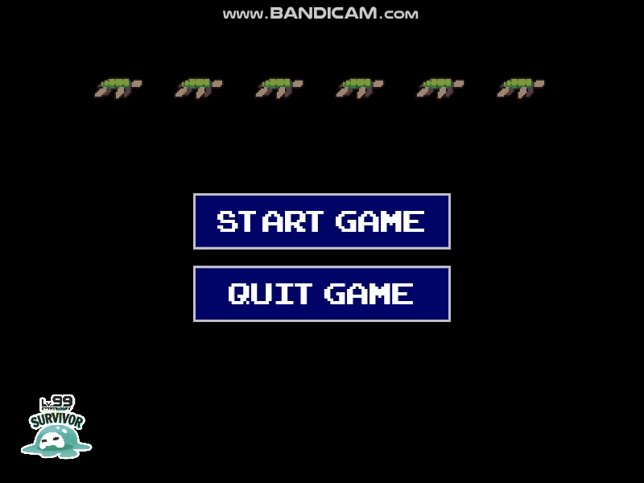
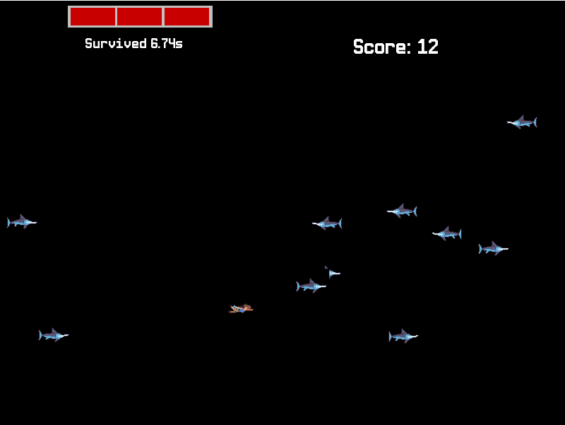

# Lv99GameJam2023

.
├── local
│   └── img
│       存储美术资源
├── myMVVM
│   └── 代码

## develop

```shell
git clone THISREPO
cd THISREPO
```

Then in conda prompt

```shell
conda create -n NEWENV
conda activate NEWENV
pip install -r requirements.txt
python run_game.py
```

## play



